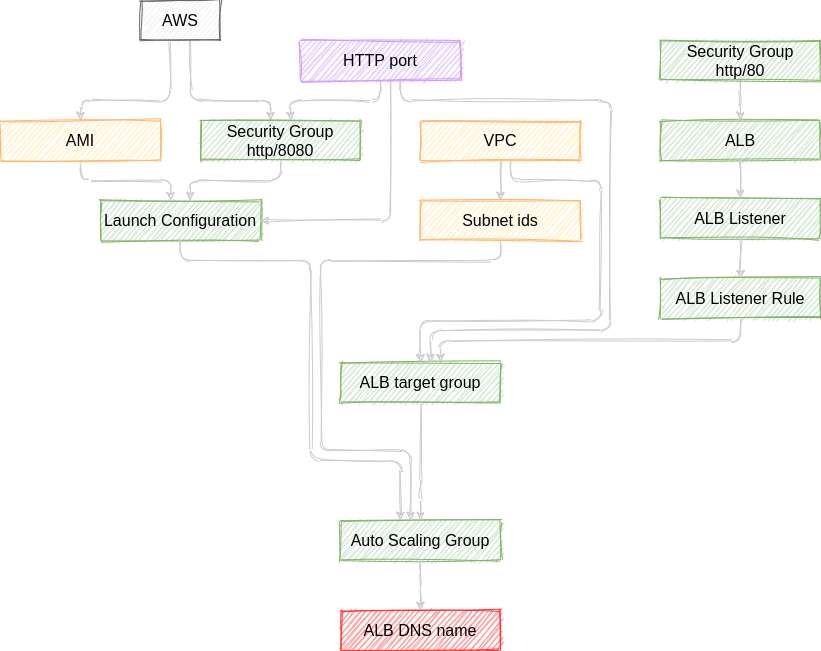

# Terraform exercises
Terraform exercises

## Exercises list

<details>
<summary>Deploy EC2 instance</summary>

**Task:**
- deploy EC2 instance with Terraform

**Directory**: `deploy-ec2`
<details>
<summary>Create configuration file</summary>

```bash
touch server.tf
```
</details>

<details>
<summary>Use AWS provider</summary>

```hcl
provider "aws" {
  region = "eu-central-1"
}
```
</details>

<details>
<summary>Add AWS AMI Datasource</summary>

- use `data "<PROVIDER>_<DATASOURCE_TYPE>" "<NAME>" {}` syntax
</details>

<details>
<summary>Add EC2 instance</summary>

- use `resource "<PROVIDER>_<RESOURCE_TYPE>" "<LOCAL_NAME>" {}` syntax
- use arguments:
  - `ami` use datasource reference syntax - `data.<PROVIDER>_<TYPE>.<NAME>.<ATTRIBUTE>`
  - `instance_type`
  - `tags.Name` - set EC2 instance name
</details>

<details>
<summary>Initialize providers</summary>

```bash
terraform init
```
</details>

<details>
<summary>Plan deployment</summary>

```bash
terraform plan
```
</details>

<details>
<summary>Apply deployment</summary>

```bash
terraform apply
```
</details>

<details>
<summary>Destroy deployment</summary>

```bash
terraform destroy
```
</details>
<hr>
</details>
<details>
<summary>Run HTTP server</summary>

**Task:**
- deploy EC2 instance with HTTP server
- output IP address


**Directory**: `http-server`

<details>
<summary>Use aws provider</summary>

```hcl
provider "aws" {
  region = "eu-central-1"
}
```
</details>

<details>
<summary>Add AMI data source</summary>

- use arguments:
  - `owners`
  - `most_recent`
  - `filter` block by name

```hcl
data "aws_ami" "ubuntu" {
  owners = ["099720109477"] # AWS account ID of Canonical
  most_recent = true
  filter = {
    name = "name"
    values = ["ubuntu/images/hvm-ssd/ubuntu-bionic-18.04-amd64-server-*"]
  }
}
```
</details>

<details>
<summary>Add security group resource</summary>

- use arguments:
  - `name` - name of the security group
  - `ingress` - incoming traffic configuration
    - `from_port` - `to_port` - open ports range
    - `protocol`
    - `cidr_blocks` - CIDR block for incoming IP addresses
</details>

<details>
<summary>Add EC2 instance</summary>

- `ami` - use from resource
- `instance_type`
- `vpc_security_group_ids` - use `id` of previously created security group  
- `user_data` - for running custom script after deploying, use heredoc syntax  
- `tags.Name` - name on AWS
</details>

<details>
<summary>Use input variable for port</summary>

- use `varaible` syntax
  - `description`
  - `default`
  - `type`
- use variable reference (`var.<VARIABLE_NAME>`) in security group
- use interpolation `"${...}"` in `user_data`
</details>

<details>
<summary>Use output for instance IP</summary>

- use `output "<NAME>" {value, description}` syntax
</details>

<hr>
</details>

<details>
<summary>Create cluster of web servers</summary>

**Task:**
- deploy cluster of http servers



**Directory**: `http-server-cluster`

<details>
<summary>Solution</summary>

<details>
<summary>Use AWS provider</summary>

- use `provider "<PROVIDER_NAME>" {}` syntax
- use `eu-cental-1` region
</details>

<details>
<summary>Create AMI Data source for Launch Configuration</summary>

- use `data "<PROVIDER>_<DATASOURCE_TYPE>" "LOCAL_NAME"` syntax
- use Canonical owner id
- use most recent image
- use Ubuntu 18.04 for name filter
</details>

<details>
<summary>Use input variable for security group http port</summary>

- use `variable "<NAME>" {}` syntax
- use port `8080` as default value
- add description
</details>

<details>
<summary>Create Security Group for Launch Configuration</summary>

- add name
- use port value from variable
- allow incoming traffic from all IPs to port from variable
</details>

<details>
<summary>Create Launch Configuration for Auto Scaling Group</summary>

- use image id from AMI datasource
- use `t2.micro` instance type
- use id of previously created security group
- use `user_data` for starting httpd server with port from variable 
- use `create_before_destroy` lifecycle settings because
  - launch configuration is immutable
  - we need create new launch configuration before destroying old
  - by default Terraform destroys old resource than creates new

</details>

<details>
<summary>Fetch default VPC for Subnet ids</summary>

- use default VPC
</details>

<details>
<summary>Fetch Subnet ids from default VPC for AWG</summary>

- use VPC id

</details>

<details>
<summary>Create Auto Scaling Group</summary>

- set VPC zone identifier from Subnet ids
- use previously created launch configuration
- deploy from 2 to 10 instances
- add name with `tag.key = 'Name'`, use `propagate_at_launch` to propagate tag to EC2 instances
- use launch configuration name as `name_prefix` to re-create ASG if launch configuration was changed
- set health check type
- set target group ARNs

</details>

<details>
<summary>Create Load balancer</summary>

- add name
- use Application LB type
- use previously created subnets ids as value for `subnets` 
- use security group

</details>

<details>
<summary>Create Load balancer listener</summary>

- set Load Balancer ARN
- set protocol
- set port
- set fixed response as default action
  - set content type
  - set message body
  - set status code
</details>

<details>
<summary>Create Security group for Load balancer</summary>

- set name
- configure incoming traffic
  - allow tcp traffic from all ips
  - open 80 port
- configure outgoing traffic
  - allow all outbound requests
</details>

<details>
<summary>Create Target group</summary>

- set name
- set port from env var for HTTP server
- set protocol
- set VPC id
- set health check parameters
  - path
  - protocol
  - matcher (port number)
  - interval
  - timeout
  - healthy threshold
  - unhealthy threshold
</details>

<details>
<summary>ALB Listener Rule</summary>

- set ALB Listener ARN
- set priority
- set path pattern to condition
- set action
  - forward to ALB Target Group

</details>

<details>
<summary>Output ALB DNS name</summary>

- use `dns_name` attribute
- add description

</details>

</details>

<hr>
</details>
